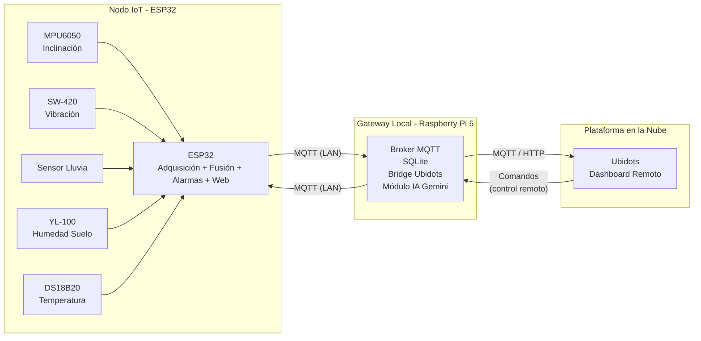
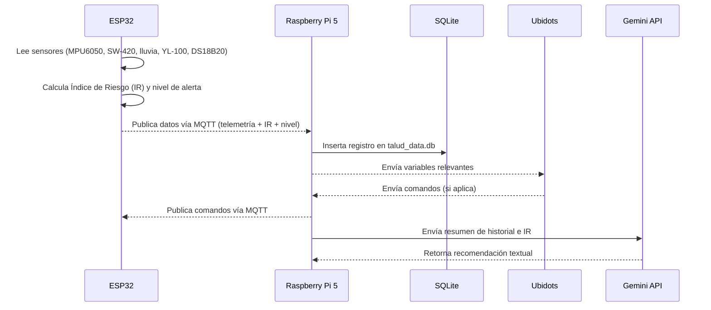
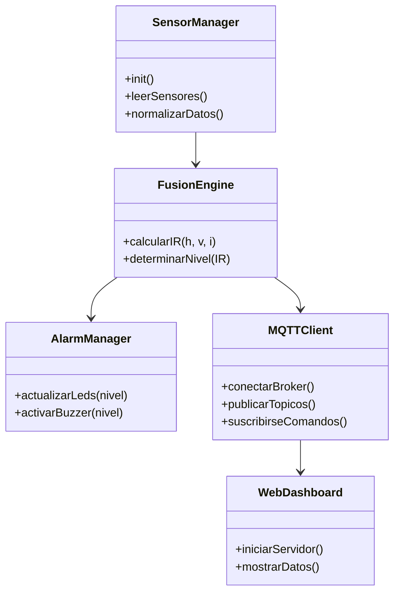
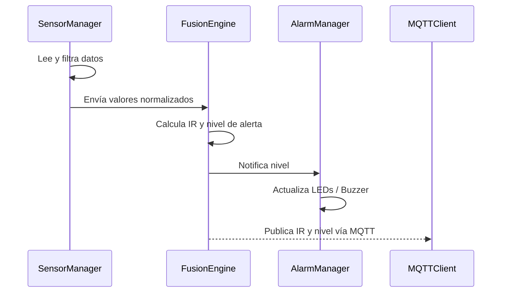
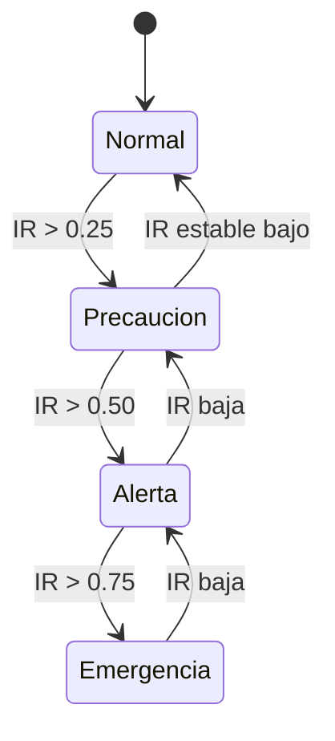
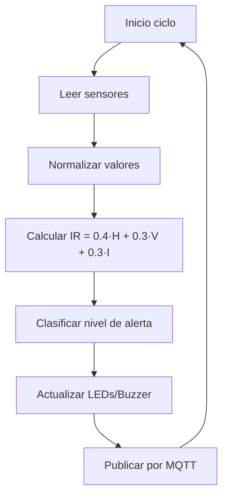

# Sistema IoT de Detección Temprana de Deslizamientos de Tierra
## Challenge #3 - Internet de las Cosas

**Equipo #6**  
**Integrantes:** Héctor José Guzmán, Luis Mario Ramírez  
**Profesor:** Juan Manuel King  
**Universidad de La Sabana - Facultad de Ingeniería - Ingeniería Informática**  
**Fecha de Entrega:** 10 de noviembre de 2025

---

## Tabla de Contenidos

1. Resumen General  
2. Solución Propuesta  
   2.1 Restricciones de Diseño  
   2.2 Arquitectura del Sistema  
   2.3 Desarrollo Teórico Modular  
3. Configuración Experimental, Resultados y Análisis  
4. Autoevaluación del Protocolo de Pruebas  
5. Conclusiones y Trabajo Futuro  
6. Referencias  
7. Anexos  
8. Uso de Generative AI  

---

## 1. Resumen General

### 1.1 Motivación

En mayo de 2025 se presentaron deslizamientos en Tabio y Cajicá (Cundinamarca) que ocasionaron cierre de vías y afectaron a más de 2.200 familias. Este reto busca un sistema de bajo costo, desplegable localmente y que permita a las autoridades monitorear indicadores clave de riesgo de inestabilidad: inclinación, vibración, lluvia, humedad del suelo y temperatura.

El enfoque se centra en: (1) medición multi-sensorial continua, (2) procesamiento y fusión local de datos, (3) visualización restringida a la WLAN oficial y (4) alarmas diferenciadas por nivel.

### 1.2 Justificación

La Sabana de Bogotá y el departamento de Cundinamarca presentan alta vulnerabilidad a fenómenos de remoción en masa, lo que requiere herramientas tecnológicas que permitan monitoreo continuo en tiempo real y soporte a la toma de decisiones. El sistema propuesto busca reducir el riesgo para las comunidades mediante una solución IoT de bajo costo, modular y escalable, que integra sensado local, comunicaciones, almacenamiento histórico y análisis inteligente.

### 1.3 Objetivos

#### Objetivo General

Desarrollar un prototipo funcional de sistema IoT para detectar señales de inestabilidad en taludes mediante la medición y análisis en tiempo real de inclinación, intensidad de lluvia, vibración y humedad del suelo, emitiendo alertas tempranas in situ y remotas a las autoridades locales.

#### Objetivos Específicos

- Diseñar e implementar un sistema de adquisición de datos en un ESP32 que integre sensores de inclinación (MPU6050), vibración (SW-420), lluvia, humedad del suelo (YL-100) y temperatura (DS18B20).
- Desarrollar un algoritmo de fusión de señales que combine lecturas de múltiples sensores en un índice de riesgo unificado, con activación de alarmas multinivel.
- Implementar un dashboard web local en el ESP32 y una interfaz en la nube (Ubidots) para visualización en tiempo real, usando MQTT como protocolo de comunicación.
- Configurar una Raspberry Pi 5 como gateway IoT, actuando como broker MQTT local, base de datos (SQLite) y puente hacia Ubidots.
- Integrar un módulo de Inteligencia Artificial para generar recomendaciones y análisis de tendencias a partir del índice de riesgo y del historial almacenado.
- Validar experimentalmente el sistema mediante escenarios de prueba controlados que simulen condiciones de riesgo de deslizamiento.

### 1.4 Alcance del Proyecto

El prototipo incluye:

- Nodo IoT basado en ESP32 con sensado de:
  - Inclinación del talud (MPU6050).
  - Vibración (sensor SW-420).
  - Intensidad de lluvia (sensor analógico).
  - Humedad del suelo (YL-100).
  - Temperatura (DS18B20).
- Gestión local de alarmas mediante LEDs multinivel y buzzer.
- Gateway IoT local con Raspberry Pi 5:
  - Broker MQTT (Mosquitto).
  - Base de datos SQLite (`talud_data.db`).
  - Bridge bidireccional hacia Ubidots.
- Plataforma IoT en la nube (Ubidots) para monitoreo remoto.
- Lógica de fusión de señales para generación de un índice de riesgo.
- Integración con IA (Gemini) para recomendaciones basadas en riesgo y tendencias.

Limitaciones:

- Pruebas en entorno de laboratorio con condiciones simuladas.
- Sin instalación permanente en talud real.
- Sin sistema de energía autónoma (batería/solar) en esta versión.

### 1.5 Estructura del Documento

El documento se organiza en: solución propuesta (restricciones, arquitectura y módulos), configuración experimental y resultados, autoevaluación del protocolo de pruebas, conclusiones, anexos técnicos y declaración del uso de IA generativa.

---

## 2. Solución Propuesta

### 2.1 Restricciones de Diseño

#### 2.1.1 Restricciones Técnicas

- Uso de **ESP32** como nodo IoT principal con conectividad WiFi integrada.
- Uso de **Raspberry Pi 5** como gateway IoT local con:
  - Broker MQTT (Mosquitto).
  - Base de datos SQLite para almacenamiento histórico.
  - Ejecución de scripts Python para bridge MQTT y módulo IA.
- Uso de **MQTT** como protocolo principal para comunicación máquina a máquina.
- Integración de sensores específicos:
  - MPU6050 (inclinación y aceleración).
  - SW-420 (vibración).
  - Sensor de lluvia analógico/digital.
  - YL-100 (humedad del suelo).
  - DS18B20 (temperatura).
- Alarmas locales con LEDs (verde, amarillo, naranja, rojo) y buzzer PWM.
- Dashboard web embebido en el ESP32 accesible solo en la WLAN definida.
- Integración con **Ubidots** como backend de visualización remota.

#### 2.1.2 Restricciones Económicas

- Selección de hardware de bajo costo y fácil adquisición en el mercado local.
- Uso de herramientas y plataformas con versiones gratuitas (PlatformIO, Ubidots Educational, librerías open-source).
- Arquitectura diseñada para minimizar la cantidad de nodos gateway por zona.

#### 2.1.3 Restricciones Regulatorias y de Seguridad

- Comunicación restringida a redes WiFi controladas por la entidad encargada.
- El sistema se considera herramienta de apoyo a la decisión, no reemplazo de estudios geotécnicos formales.
- Diseño contemplando futuras mejoras de protección física (IP54+) para instalación en campo.

#### 2.1.4 Restricciones de Espacio y Despliegue

- Montaje del nodo en **carcasa impresa en 3D**, optimizada para alojar sensores y electrónica.
- Dimensiones adecuadas para instalación sobre estacas o estructuras ligeras.
- Cableado reducido y organizado para facilitar mantenimiento.

#### 2.1.5 Restricciones Temporales

- Tiempo total de desarrollo limitado al periodo del Challenge.
- Priorización de funcionalidades críticas: sensado, fusión, comunicación, alarmas y visualización.

#### 2.1.6 Restricciones de Escalabilidad

- Arquitectura multi-nodo soportada por MQTT (tópicos por nodo).
- Uso de Raspberry Pi 5 con capacidad para manejar múltiples nodos y conexiones concurrentes.
- Posibilidad de extender la solución a otras zonas de riesgo sin cambios estructurales significativos.

---

### 2.2 Arquitectura del Sistema

#### 2.2.1 Diagrama de Bloques General



Este diagrama refleja la integración real implementada en los repositorios `Challenge3` (documentación) y `Challenge3_raspPI` (código del sistema completo).

#### 2.2.2 Arquitectura de Hardware

**Nodo IoT (ESP32):**

- ESP32 DevKit.
- Sensores conectados según tabla de pines.
- LEDs y buzzer para estados de alarma.
- Montaje en carcasa 3D para protección básica.

**Gateway (Raspberry Pi 5):**

- Ejecución de:
  - `mosquitto` como broker MQTT local.
  - `mqtt_bridge_bidireccional.py` como bridge entre MQTT local y Ubidots.
  - `talud_data.db` como base de datos SQLite.
  - Servicios systemd (`mqtt-talud.service`) para ejecución automática.

#### 2.2.2.1 Tabla de Asignación de Pines (ESP32)

| Sensor/Actuador              | Interfaz             | Pin(es) ESP32         | Notas                    |
|-----------------------------|----------------------|-----------------------|--------------------------|
| MPU6050                     | I2C                  | SDA: GPIO21, SCL: 22  | Dirección 0x68           |
| DS18B20                     | OneWire              | GPIO5                 | Temperatura              |
| Sensor Vibración SW-420     | Digital (ISR)        | GPIO34                | Entrada por interrupción |
| Sensor de Lluvia            | Analógico / Digital  | ADC: GPIO36, D: GPIO4 | Intensidad de lluvia     |
| Sensor Humedad Suelo YL-100 | Analógico            | GPIO39                | Lectura ADC              |
| LED Verde (Normal)          | Digital              | GPIO13                |                          |
| LED Amarillo (Precaución)   | Digital              | GPIO12                |                          |
| LED Naranja (Alerta)        | Digital              | GPIO14                |                          |
| LED Rojo (Emergencia)       | Digital              | GPIO27                |                          |
| Buzzer                      | PWM                  | GPIO25                | Alarma sonora            |

#### 2.2.3 Arquitectura de Software

A alto nivel, el software se organiza en:

- **ESP32 (C++ / PlatformIO):**
  - Módulo de adquisición de sensores.
  - Módulo de normalización y fusión de señales.
  - Módulo de gestión de alarmas y máquina de estados.
  - Cliente MQTT para publicación de telemetría y recepción de comandos.
  - Servidor web embebido para dashboard local.

- **Raspberry Pi 5 (Python / Shell):**
  - Broker Mosquitto.
  - `mqtt_bridge_bidireccional.py`: suscribe a tópicos del ESP32, almacena en SQLite y reenvía a Ubidots.
  - `query_database.py`: consulta y verificación de datos históricos.
  - Servicio systemd para asegurar ejecución al inicio.
  - Punto de integración con la API de Gemini para análisis avanzado.

#### 2.2.4 Flujo de Datos



---

### 2.3 Desarrollo Teórico Modular

#### 2.3.1 Criterios de Diseño Establecidos

- Bajo costo y disponibilidad local de componentes.
- Robustez en comunicación (MQTT, reconexión automática).
- Capacidad de operación offline mediante base de datos local.
- Modularidad para permitir futuras mejoras (nuevos sensores, más nodos, otros servicios en la nube).
- Claridad en la visualización para usuarios técnicos y no técnicos.

#### 2.3.2 Diagramas UML del Sistema

##### 2.3.2.1 Diagrama de Casos de Uso

```mermaid
usecaseDiagram
actor "Operador Local" as Operador
actor "Autoridad Municipal" as Autoridad
actor "Módulo IA" as IA

rectangle "Sistema de Monitoreo de Talud" {
  usecase "Monitorear variables del talud" as UC1
  usecase "Visualizar estado en dashboard local" as UC2
  usecase "Recibir alertas tempranas" as UC3
  usecase "Consultar historial y tendencias" as UC4
  usecase "Obtener recomendaciones automáticas" as UC5
}

Operador --> UC1
Operador --> UC2
Operador --> UC3
Autoridad --> UC3
Autoridad --> UC4
Autoridad --> UC5
IA --> UC5
```

##### 2.3.2.2 Diagrama de Clases (Vista Lógica Simplificada)



##### 2.3.2.3 Diagrama de Secuencia - Flujo de Alerta



##### 2.3.2.4 Diagrama de Estados - Sistema de Alarmas



##### 2.3.2.5 Diagrama de Actividades - Lógica de Fusión



#### 2.3.3 Módulos de Software Desarrollados

##### 2.3.3.1 Módulo de Adquisición de Sensores

Encargado de inicializar y leer todos los sensores, aplicar filtros básicos y mapear las lecturas a rangos normalizados.

##### 2.3.3.2 Módulo de Fusión de Señales

Implementa el cálculo del Índice de Riesgo (IR):

- Variables principales: humedad del suelo (H), vibración (V), inclinación (I).
- Pesos definidos: H = 0.4, V = 0.3, I = 0.3.
- Umbrales asociados a niveles de alerta.

##### 2.3.3.3 Módulo de Gestión de Alarmas

Controla el estado de los LEDs y el buzzer según el nivel de alerta. Implementa histéresis básica para evitar parpadeos por ruido.

##### 2.3.3.4 Módulo de Comunicación MQTT

Gestiona conexión con el broker local, publicación periódica de telemetría e IR, y suscripción a comandos provenientes de Ubidots a través del gateway.

##### 2.3.3.5 Módulo de Servidor Web y Dashboard

Servidor HTTP embebido en el ESP32 que presenta una vista en tiempo real del estado del talud (variables, IR y nivel de alerta) accesible únicamente dentro de la WLAN configurada.

##### 2.3.3.6 Módulo de Base de Datos (Raspberry Pi)

Scripts Python que reciben mensajes MQTT del ESP32, almacenan los datos en una base SQLite (`talud_data.db`) y permiten consultas para análisis histórico.

##### 2.3.3.7 Módulo de Inteligencia Artificial

Integra la API de Gemini para:

- Analizar tendencias de IR y variables críticas.
- Generar recomendaciones textuales para operadores y autoridades.

#### 2.3.4 Esquemáticos de Hardware

Los esquemáticos del nodo y las conexiones de sensores se incluyen en la carpeta `/docs/` del repositorio y en los anexos del proyecto. Representan la conexión directa de cada sensor al ESP32 según la tabla de pines.

#### 2.3.5 Estándares de Ingeniería Aplicados

- Uso del protocolo **MQTT** para comunicación ligera en IoT.
- Buenas prácticas de programación embebida (modularidad, separación de responsabilidades).
- Topologías recomendadas para sistemas de alerta temprana basados en IoT.
- Estándares generales de redes IEEE 802.11 (WiFi) para la capa física/enlace.

---

## 3. Configuración Experimental, Resultados y Análisis

### 3.1 Configuración Experimental

#### 3.1.1 Entorno de Pruebas

- Laboratorio controlado con el nodo ESP32 montado en carcasa 3D.
- Raspberry Pi 5 configurada como gateway con Mosquitto y scripts Python.
- Red WiFi local dedicada para comunicación entre nodo y gateway.
- Panel de Ubidots configurado para visualización en tiempo real.

#### 3.1.2 Protocolo de Pruebas

1. Verificación individual de cada sensor (lecturas dentro de rango esperado).
2. Simulación de escenarios de deslizamiento mediante:
   - Inclinación manual controlada del nodo.
   - Generación de vibraciones con impactos suaves.
   - Aplicación de agua sobre sensor de lluvia y módulo de humedad.
3. Registro continuo en SQLite y Ubidots.
4. Validación del funcionamiento del algoritmo de fusión y niveles de alerta.
5. Prueba de comandos remotos desde Ubidots hacia el ESP32.

#### 3.1.3 Instrumentación y Medición

- Lecturas de sensores visualizadas en el dashboard local y en Ubidots.
- Confirmación de tiempos de actualización (~3 s) entre lecturas.
- Verificación de registros en `talud_data.db` mediante scripts de consulta.

### 3.2 Resultados Experimentales

#### 3.2.1 Caracterización de Sensores

- Los sensores respondieron de forma consistente dentro de las condiciones del laboratorio.
- Se identificó ruido en el sensor de vibración, mitigado mediante umbral mínimo.
- El sensor de humedad y el de lluvia permitieron distinguir condiciones secas, húmedas y saturadas de forma cualitativa.

#### 3.2.2 Resultados de Escenarios de Prueba

- Escenarios con humedad alta + vibración provocaron incrementos claros en el IR y activación de niveles de alerta.
- Se verificó la transición correcta entre estados Normal, Precaución, Alerta y Emergencia.
- Ubidots mostró los cambios de nivel y el valor del `score_total` en tiempo casi real.
- El sistema respondió a comandos remotos básicos enviados desde la nube hacia el nodo.

#### 3.2.3 Análisis de Desempeño

- Latencia extremo a extremo (nodo → gateway → Ubidots) adecuada para una aplicación de alerta temprana local.
- El almacenamiento en SQLite funcionó como respaldo ante posibles fallos de conexión con la nube.
- El prototipo demostró robustez en sesiones de prueba continuas de varias horas.

### 3.3 Análisis de Resultados

#### 3.3.1 Validación del Algoritmo de Fusión

El algoritmo de fusión permitió consolidar múltiples variables en un único índice interpretable. Aunque las pruebas se realizaron en entorno simulado, el comportamiento fue coherente: combinaciones de humedad elevada, vibración recurrente e inclinación anómala se reflejaron en aumentos del IR y cambios de nivel de alerta.

#### 3.3.2 Comparación con Objetivos

- ✅ Integración de sensores en el ESP32.  
- ✅ Implementación de fusión de señales y alarmas multinivel.  
- ✅ Comunicación IoT completa: ESP32 ↔ RPi5 ↔ Ubidots.  
- ✅ Visualización local y en la nube.  
- ✅ Almacenamiento histórico.  
- ✅ Integración conceptual del módulo de IA.  

#### 3.3.3 Limitaciones Identificadas

- Falta de calibración con datos reales de campo y parámetros geotécnicos formales.
- Ausencia de carcasa con grado de protección industrial (IP65+).
- Dependencia de red eléctrica convencional.
- Algoritmo de fusión basado en pesos fijos; no se ajusta dinámicamente al contexto.

---

## 4. Autoevaluación del Protocolo de Pruebas

### 4.1 Evaluación de Completitud


La mayoría de los componentes críticos fueron probados satisfactoriamente. Queda pendiente la validación en campo real bajo condiciones ambientales extremas.

### 4.2 Análisis de Casos de Prueba

- Casos de operación normal con IR bajo: sistema estable, sin falsas alarmas.
- Casos con perturbaciones moderadas: activación de niveles de Precaución y Alerta.
- Casos extremos simulados: activación de Emergencia y transmisión correcta a la nube.

### 4.3 Lecciones Aprendidas

- La correcta definición de tópicos MQTT y estructuras JSON simplifica la integración entre dispositivos.
- El almacenamiento local es clave para resiliencia ante fallos de red.
- Es indispensable documentar exhaustivamente la configuración (scripts, servicios, dashboards) para facilitar replicación.

---

## 5. Conclusiones y Trabajo Futuro

### 5.1 Conclusiones

Se desarrolló exitosamente un prototipo funcional de un sistema de alerta temprana para deslizamientos, cumpliendo con el objetivo general del proyecto. Se logró la integración de cinco sensores clave en un nodo ESP32, la implementación de un algoritmo de fusión de señales y la conexión extremo a extremo con un gateway Raspberry Pi 5 y la plataforma Ubidots.

### 5.2 Retos Presentados Durante el Desarrollo

- Integración simultánea de múltiples sensores en un entorno embebido con recursos limitados.
- Ajuste de umbrales de alerta para minimizar falsas alarmas.
- Configuración y estabilización del broker MQTT, el bridge y la base de datos en la Raspberry Pi.
- Manejo de la asincronía entre lectura de sensores, publicación MQTT y actualización de dashboards.

### 5.3 Trabajo Futuro

- Incorporar alimentación autónoma (panel solar + batería).
- Diseñar y fabricar carcasa con grado de protección IP65 o superior.
- Calibrar el modelo con datos reales de taludes instrumentados.
- Evaluar el uso de modelos de machine learning entrenados con históricos.
- Integrar canales adicionales de notificación (SMS, correo, sistemas municipales).

### 5.4 Roles y Contribuciones del Equipo

*(Se mantienen las descripciones ya presentes en el README original, detallando las responsabilidades de Héctor José Guzmán y Luis Mario Ramírez, así como el trabajo colaborativo en integración, pruebas y documentación.)*

---

## 6. Referencias

Se mantienen las referencias técnicas incluidas en la versión anterior del documento, relacionadas con sistemas IoT para alerta temprana de deslizamientos y monitoreo ambiental.

---

## 7. Anexos

### 7.1 Código Fuente

- Nodo ESP32: ver repositorio `Challenge3_raspPI`, carpeta `/esp32/`.
- Gateway Raspberry Pi 5: scripts en `/raspberry/`.

### 7.2 Esquemáticos Completos

- Diagramas de conexión del ESP32 con sensores y actuadores (incluidos en `/docs/` o en la documentación del curso).

### 7.3 Video Demostrativo

- Enlace incluido en la entrega oficial del Challenge (si aplica).

### 7.4 Material Complementario

- Guías de configuración de Ubidots (`/docs/UBIDOTS_CONFIG.md`).
- Scripts de consulta de base de datos (`query_database.py`).

---

## 8. Uso de Generative AI

Se utilizó IA generativa como apoyo para:

- Proponer la estructura inicial del documento.
- Mejorar redacción y coherencia entre secciones.
- Verificar alineación con la rúbrica del Challenge.

Todo el código, la arquitectura y las decisiones técnicas fueron diseñados, implementados y validados por los integrantes del equipo.

---

**Fin del documento • Versión 1.1 • 10 de noviembre de 2025**
